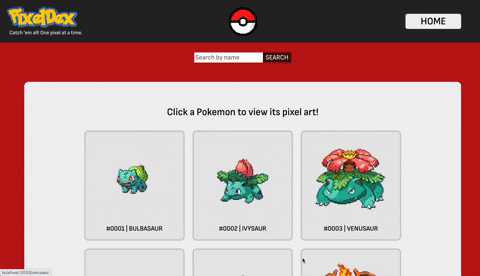
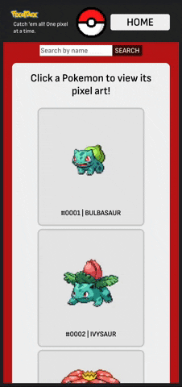

# PixelDex

## Table of Contents
  - [Introduction](#Introduction)
  - [Technologies](#Technologies)
  - [Contributors](#Contributors)
  - [Illustrations](#Illustrations)
  - [Deployed Page](#Deployed-Page)
  - [Wins](#Wins)
  - [Challenges & Improvements](#Challenges-&-Improvements)
  - [Set Up](#Set-Up)
  - [Sources](#Sources)
  - [Project Spec](#Project-Spec)

## Introduction
Welcome to the world of PixelDex!

PixelDex is an app aimed at lovers of Pokemon and their sprite art, hosted by [PokeAPI](https://pokeapi.co/). Upon visiting the main page, the user can click any Pokemon, or look one up by its name. They will then be directed to a page that shows all of that Pokemon's sprites from across the different generations, plain and simple.

This project was completed as part of Turing School of Software Design's front end curriculum. We were challenged with proposing a project and its MVP, which we were expected to complete within five days. It pushed us to gauge our abilities, what we've learned, and how realistic our expectations could be. It required commitment to a plan and the ability to be judicious and flexible while executing the project. It was the culmination of all we learned in Mod 3, applied in a fast-paced, agile environment.

## Technologies
  - React
  - Router
  - PropTypes
  - Cypress
  - Agile methodology

## Contributor
[Kirk Hauck](https://github.com/kirkhauck)

## Demo GIFs

### Desktop View

### Mobile View

## Deployed Page

Visit [PixelDex]()

## Wins and Challenges

### Challenge

Extracting the Pokemon URL links from the objects returned by the API, which were deeply nested and in different layers of depth.

### Win

Created a recursive function in `SpritesContainer.js` to take in the Pokemon object and utilize a `for in` loop to extract the property values that were strings and dig deeper into property values that were objects. Due to the nature of the `sprites` property in the object, this was a viable approach because all the property values that were strings were urls.

### Challenge

Displaying all the Pokemon on the main page without making 1,008 fetch requests.

### Win

When fetching Pokemon from the API, you could make a fetch request to `/pokemon/:pokemon` (replacing `:pokemon` with the Pokemon's name or Pokedex Number), and receive the full Pokemon object. You could also fetch just to `/pokemon` and receive an array of Pokemon objects (with a query-controlled page limit). However, the objects in the array did not contain all the Pokemon's information, just the name and a link to the full Pokemon object. In order to render sprites, a single fetch request was made to return an array of all the Pokemon objects, and the `name` property values were interpolated into a url to link to each Pokemon's default, front-facing sprite.

## Set Up

1. Fork this repo  
2. Clone the repo to your local machine   
3. Run `npm i`, then ` npm run build`, then `npm start`
4. View the project in the browser by opening localhost:3000

## Sources
  - [PokeAPI](https://pokeapi.co/)
  - [MDN](http://developer.mozilla.org/en-US/)
  - [React Docs](https://reactjs.org/docs/getting-started.html)
  - [Cypress Docs](https://docs.cypress.io/guides/overview/why-cypress.html)